# Anthem — TryHackMe Writeup

**Platform:** TryHackMe | **Difficulty:** Easy | **Target IP:** 10.67.145.53 | **Attacker IP:** 192.168.146.25

## Machine info

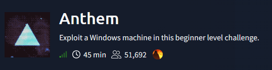

## Summary

**Anthem** is a Windows machine running an Umbraco CMS blog on IIS, with RDP exposed. The box leans on OSINT-style clues hidden in the blog content and `robots.txt` rather than a direct exploit chain: a blog post leaks the organization's email naming convention, a second post hides a nursery rhyme whose unstated subject gives up the real username, and `robots.txt` leaks the matching password in plain text. Password reuse then carries the attacker from the Umbraco backoffice straight through to RDP as a standard user, and a world-unreadable backup file left on disk hands over the Administrator's plaintext password for full system compromise.
**Attack chain:** Recon → Blog & robots.txt OSINT → Umbraco Credential Discovery → RDP Access (password reuse) → User Flag → Manual Filesystem Enumeration → Backup Password Leak → Administrator RDP → Root Flag

## 1. Reconnaissance

```
nmap -p- -Pn -sV -sC -oN scan.txt 10.67.145.53

PORT     STATE SERVICE       VERSION
80/tcp   open  http          Microsoft HTTPAPI httpd 2.0 (SSDP/UPnP)
| http-robots.txt: 4 disallowed entries
|_/bin/ /config/ /umbraco/ /umbraco_client/
|_http-title: Anthem.com - Welcome to our blog
3389/tcp open  ms-wbt-server Microsoft Terminal Services
| ssl-cert: Subject: commonName=WIN-LU09299160F
| rdp-ntlm-info:
|   Target_Name: WIN-LU09299160F
|   Product_Version: 10.0.17763
Service Info: OS: Windows; CPE: cpe:/o:microsoft:windows
```

Only two ports are open: HTTP (80) and RDP (3389). The `robots.txt` disallow list already points at an Umbraco install (`/umbraco/`, `/umbraco_client/`), and `rdp-ntlm-info` confirms a Windows Server 2019 host (build 17763).

```
gobuster dir -u http://10.67.145.53/ -w /usr/share/wordlists/dirbuster/directory-list-2.3-medium.txt -x txt,js,php

search               (Status: 200)
blog                 (Status: 200)
rss                  (Status: 200)
sitemap              (Status: 200)
categories           (Status: 200)
authors              (Status: 200)
tags                 (Status: 200)
install              (Status: 302) [--> /umbraco/]
robots.txt           (Status: 200)
```

`install` redirecting to `/umbraco/` confirms the CMS; `blog` stands out as the most promising content to review next.

## 2. Web & OSINT Enumeration

The blog post **"We are hiring"** reveals the organization's email naming convention (first-initial + last-initial @ domain):

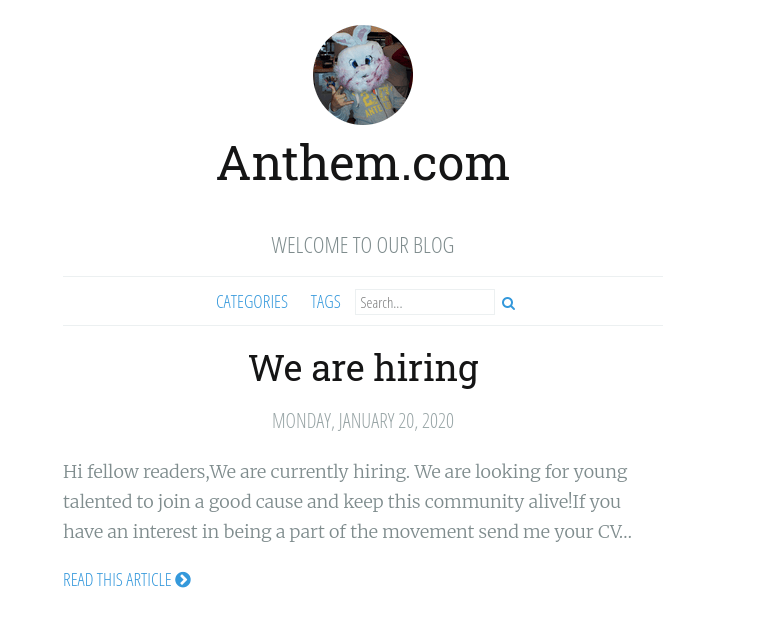

A second post, **"A cheers to our IT department"**, publishes a poem with its subject's name stripped out — the text and structure match the classic English nursery rhyme *Solomon Grundy*, though the post attributes it to "James Orchard Halliwell" (the real-world folklorist who recorded the original rhyme, unrelated to this machine):

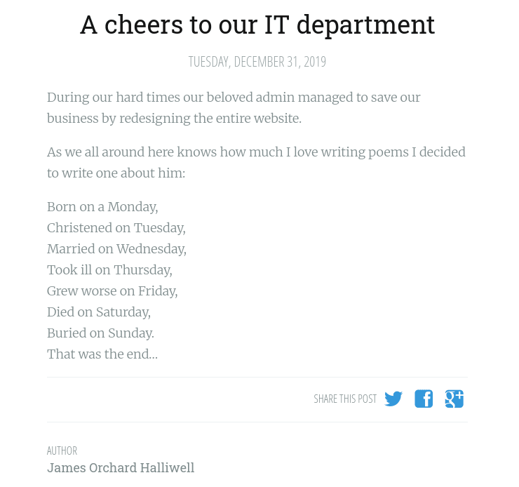

`robots.txt` leaks a password in plain text above the actual disallow rules:

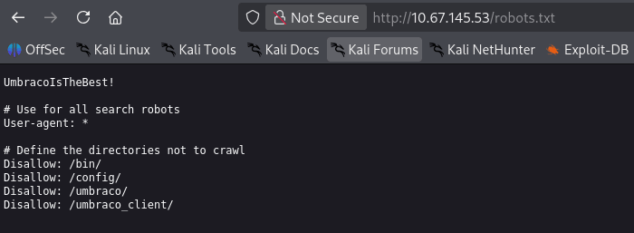

## 3. Credential Discovery & Initial Access

Combining the clues: the hidden subject of the poem ("Solomon Grundy") suggests the real username is built from those initials (**SG**), following the same `@anthem.com` convention seen in the hiring post, paired with the password leaked in `robots.txt`. Logging into the Umbraco backoffice at `/umbraco/` with `SG@anthem.com` / `UmbracoIsTheBest!` succeeds:

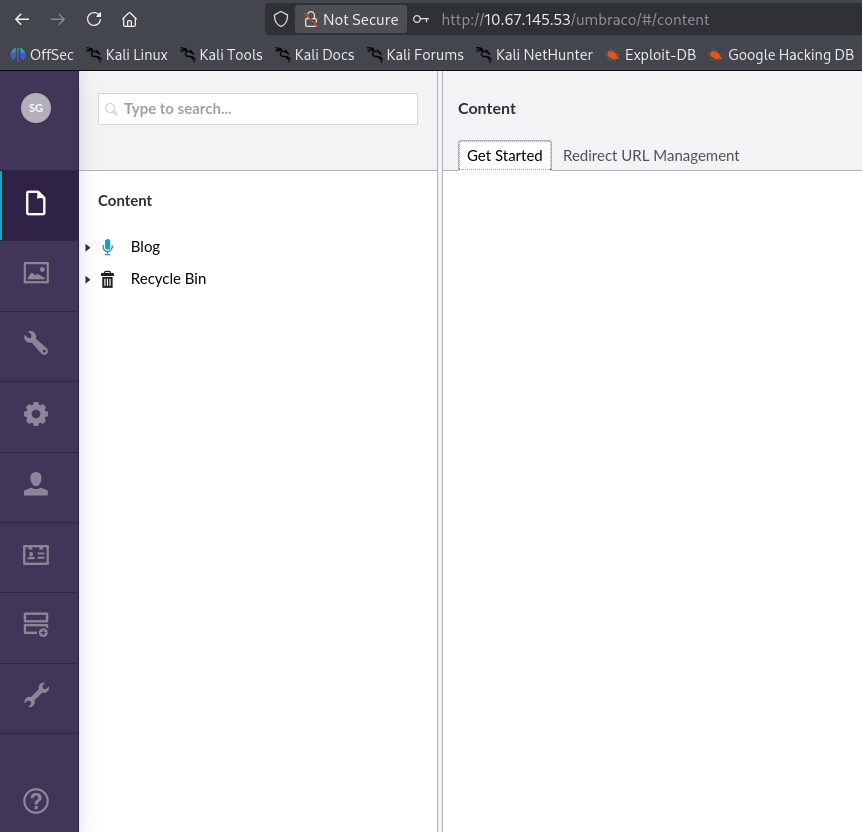

The backoffice Help section confirms **Umbraco CMS 7.15.4**.

## 4. RDP Access & User Flag

Since the Umbraco account's credentials might be reused for a Windows account of the same name, RDP was tried directly against the host:

```
rdesktop -u SG -p 'UmbracoIsTheBest!' 10.67.145.53
```

The password reuse pays off, landing a graphical session as the local user `SG`:

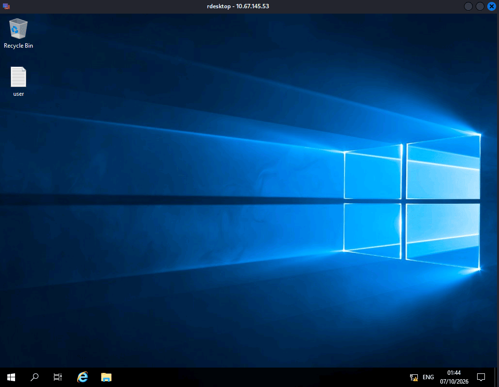

`user.txt` on the desktop confirms it:

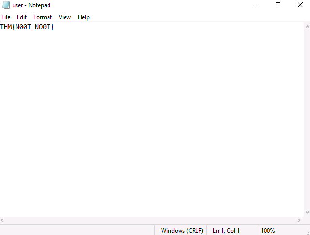

**Flag:** `THM{N00T_N00T}`

## 5. Privilege Escalation — Backup Password Leak

Standard privilege-escalation checks (`whoami /priv`, `whoami /groups`) showed only default, non-exploitable privileges for `SG`. With no usable token privilege, the filesystem was enumerated manually through File Explorer, starting by toggling **Hidden items** on in the View ribbon to make sure nothing was missed:

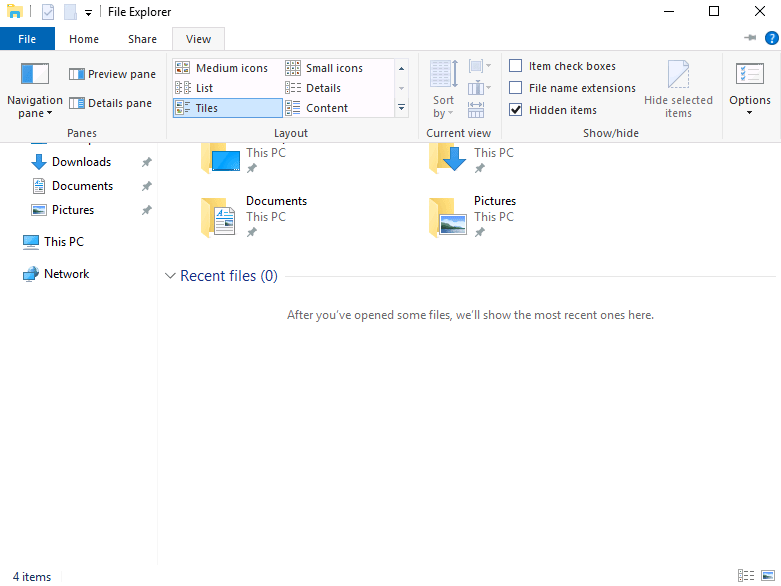

Confirmed through the classic **Folder Options** dialog as well (File Explorer Options → View), where **Show hidden files, folders, and drives** is selected:

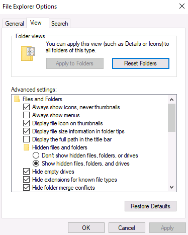

Browsing `C:\` then turns up a `backup` folder not seen in any previous listing:

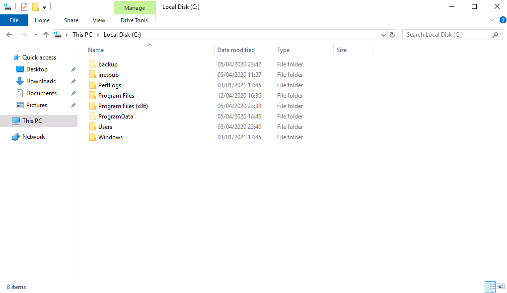

Inside it sits a single file, `restore.txt`:

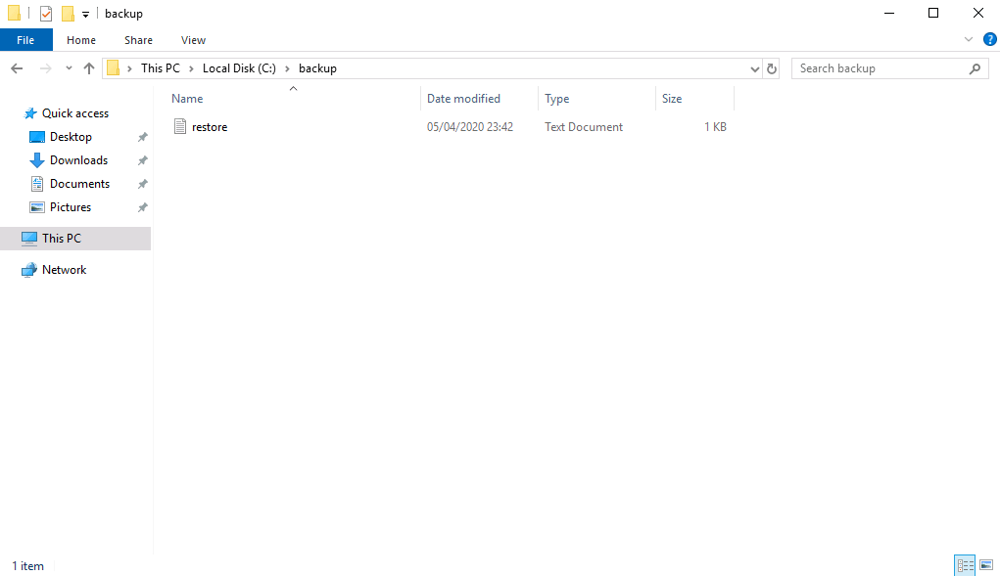

Opening it as `SG` is denied:

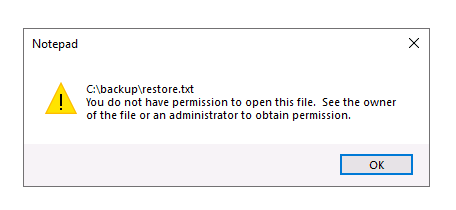

Its **Security** tab shows the ACL has no groups or users granted access at all, but confirms `SG` is the object's effective owner, so permissions can still be edited:

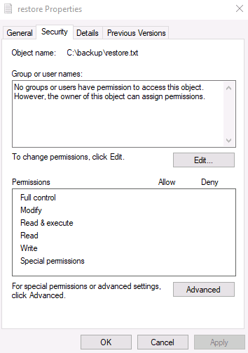

Adding `SG` with **Read** access through **Edit → Add**:

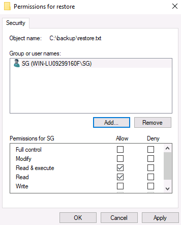

With read access granted, the file opens and reveals the Administrator's plaintext password:

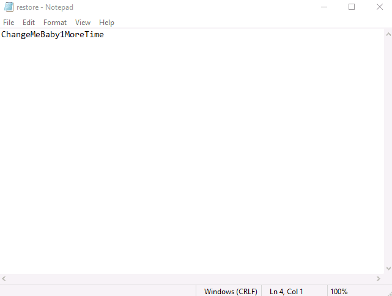

## 6. Root Access

With a plaintext Administrator password in hand, a fresh RDP session was opened directly as that account:

```
rdesktop -u Administrator -p 'ChangeMeBaby1MoreTime' 10.67.145.53
```

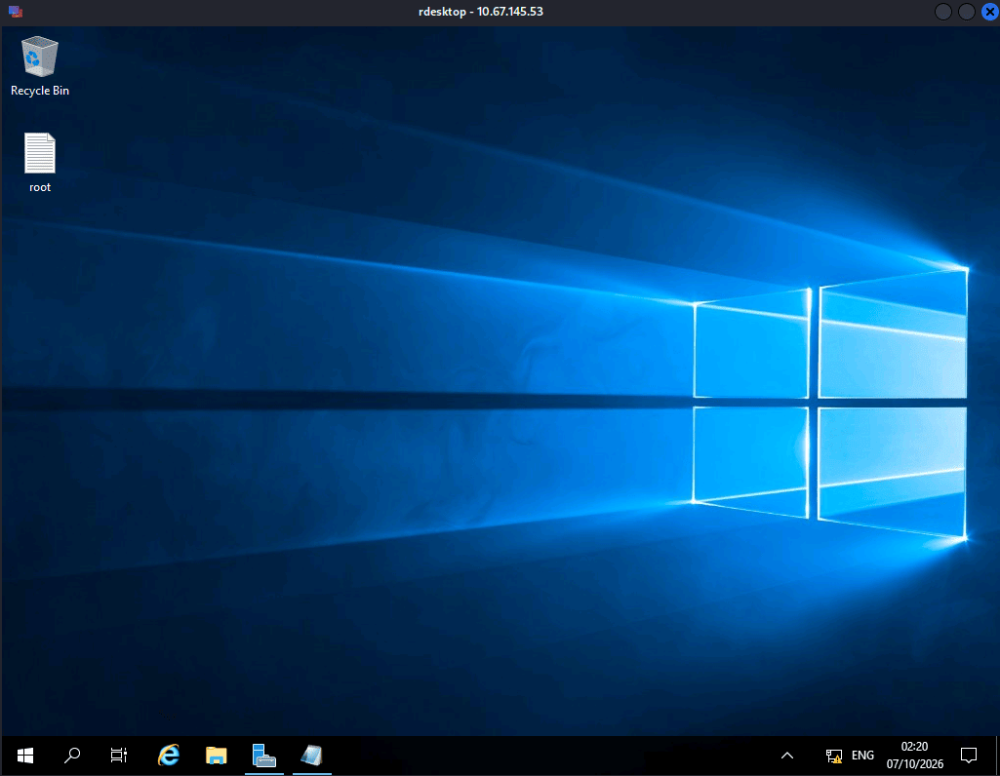

`root.txt` on the desktop confirms full compromise:

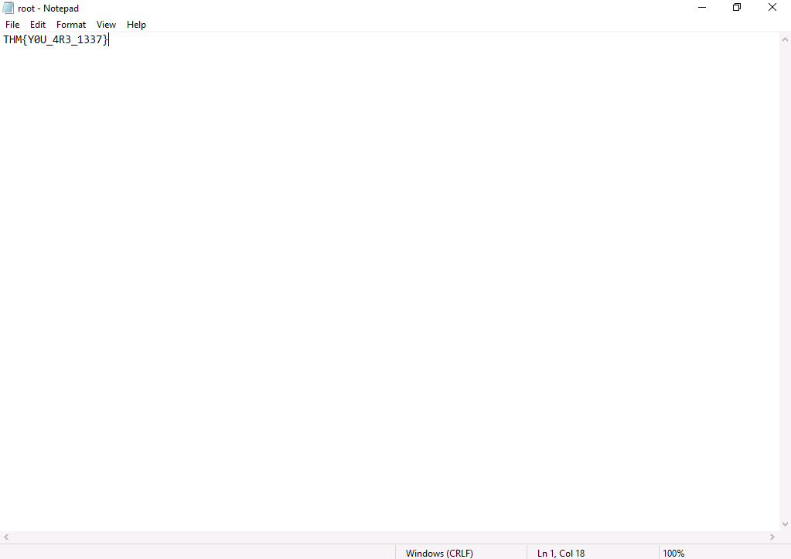

**Flag:** `THM{YOU_4R3_1337}`

## Root Cause & Remediation

| Issue | Fix |
|---|---|
| Admin password left in plain text at the top of the public `robots.txt` | Never place credentials, notes, or "jokes" in any publicly reachable file |
| Blog content (hiring post, poem) indirectly reveals the real Umbraco username | Avoid publishing internal naming conventions or identity hints in public-facing content |
| Umbraco backoffice password reused for the Windows RDP account `SG` | Enforce unique, unrelated passwords per service and account |
| Backup file `C:\backup\restore.txt` stored the Administrator's plaintext password with an ACL the owner could freely reassign | Store secrets in a vault/secrets manager, never in plaintext files; lock down ACLs so even the file owner can't self-grant access without audit |
| Administrator password reused for direct RDP login | Disable direct RDP for the built-in Administrator account; require MFA or a jump host for privileged remote access |
