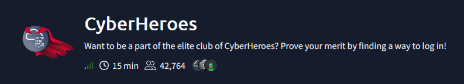
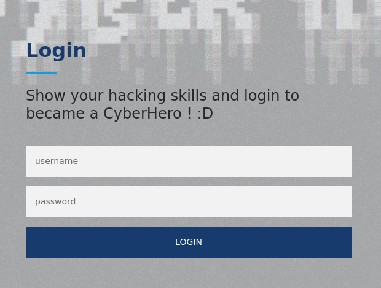
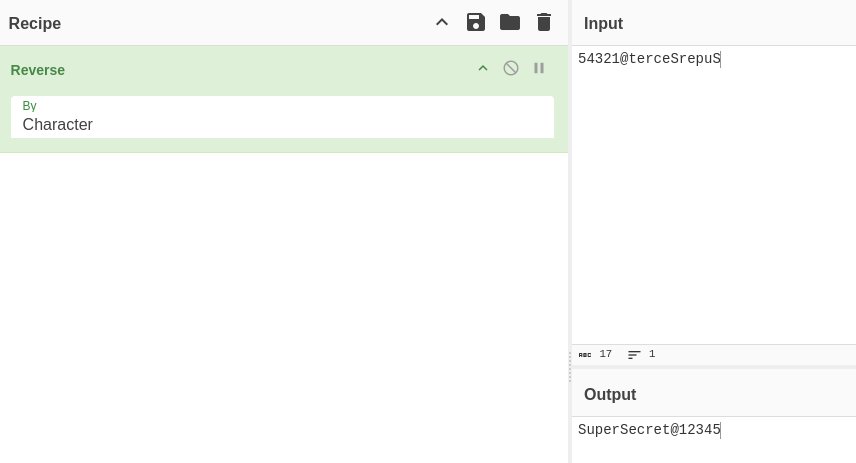
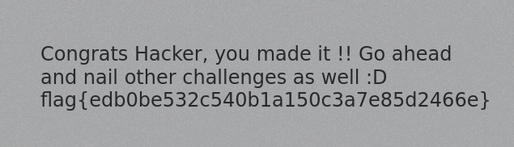

# CyberHeroes — TryHackMe Writeup

**Platform:** TryHackMe | **Difficulty:** Easy | **Target IP:** 10.67.145.221 | **Attacker IP:** 192.168.146.25

## Machine info



## Summary

**CyberHeroes** is a single-page login challenge that asks the player to "find a way to log in" to become part of the elite club. The entire authentication check runs client-side in plain JavaScript, so the credentials and the mechanics of the flag retrieval are fully exposed to anyone who reads the page source.

**Attack chain:** View page source → extract hardcoded username and reversed password → decode the password with CyberChef → submit the login form → flag retrieved via XHR request.

## 1. Source Code Review

Viewing the page source reveals the `authenticate()` function wired to the login button. It compares the input fields against a hardcoded username and a password obfuscated by string reversal:

```
const RevereString = str => [...str].reverse().join('');
if (a.value=="h3ck3rBoi" & b.value==RevereString("54321@terceSrepuS")) {
  ...
  xhttp.open("GET", "RandomLo0o0o0o0o0o0o0o0o0o0gpath12345_Flag_"+a.value+"_"+b.value+".txt", true);
  xhttp.send();
}
```

The username is plaintext (`h3ck3rBoi`), and the password is just the string `54321@terceSrepuS` reversed. On a successful match, the script fetches a `.txt` file whose name is built from the username and password themselves — the flag is served from a predictable, client-constructed path with no server-side authorization.



## 2. Credential Decoding

Reversing `54321@terceSrepuS` character by character in CyberChef gives the real password, `SuperSecret@12345`.



## 3. Login & Flag

Submitting the form with `h3ck3rBoi` / `SuperSecret@12345` triggers the XHR request to the flag file, and the response is written directly into the page.



**Flag:** `flag{edb0be532c540b1a150c3a7e85d2466e}`

## Root Cause & Remediation

| Issue | Fix |
|---|---|
| Authentication logic (username, password, and flag-file path) implemented entirely in client-side JavaScript | Perform authentication server-side; never ship credentials or secret-resource paths in code the client can read |
| Password "obfuscated" with a trivially reversible string reversal | Use proper hashing for stored credentials, not reversible encoding, and never transmit sensitive values to the client at all |
| Flag file protected only by an unguessable, randomized URL | Enforce real server-side authorization on sensitive resources instead of relying on security through obscurity |
